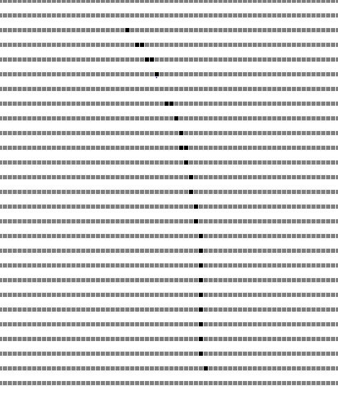

# 11.2 寻路 | 实现一个地图编辑器

通过`同余原理`使用一维数组创建了一个 100\*100（10000 个格子）的地图绘制页面，按住左键开始绘制，按住右键进行删除，同时还通过浏览器的`localStorage`实现了保存地图的功能。

## 问题记录

### div 间缝隙

在绘制`cell`时出现了 div 行间距非常大的问题



在查找资料后发现原因:

> 在 line-block 模式下，元素被当成行内元素排版，元素之间的空白符（空格、回车换行等）都会被浏览器处理，根据 white-space 的处理方式（默认是 normal，合并多余空白），原来 HTML 代码中的回车换行被转成一个空白符，在字体不为 0 的情况下，空白符占据一定宽度，所以 inline-block 的元素之间就出现了空隙。这些元素之间的间距会随着字体的大小而变化，当行内元素 font-size:16px 时，间距为 8px。

**解决方案**

**方案一、元素间不换行**

```js
<div class="box">
  <span>111</span><span>111</span>
</div>
```

此方案不具备可读性，且为生成 div 没法控制这个问题，所以不考虑。

**方案二、font-size:0;**

```css
#container {
  font-size: 0px;
  width: 701px;
}
```

给父元素设置一个`font-size:0;`的样式，这个方案是根据`在字体不为 0 的情况下，空白符占据一定宽度，同时这些元素之间的间距会随着字体的大小而变化。`这一规则着手，将 div 间存在的空白字符字体设置为 0 让其显示不出来即可。

如果子元素中有需要显示的文字，则给子元素单独设置正确的字体大小即可。

最终实现时，使用了这个方案。

**方案三、负 margin 方法**

这个方案没能成功，同时这个方案由于`在字体不为 0 的情况下，空白符占据一定宽度，同时这些元素之间的间距会随着字体的大小而变化。`这个问题导致 margin 的值也是一个浮动的值，不灵活所以所以不考虑。

---

在群里看到助教老师提出了一种不知道的方案记录下

**方案四、去掉`<!DOCTYPE html>`**

根据 winter 老师的《重学前端》<sup>[1]</sup>专栏和[MDN]<sup>[2],[3]</sup>可知`<!DOCTYPE html>`是一种 DTD，它现在唯一的作用就是启用标准模式。

在尝试去掉了以后，div 间的缝隙真的不见了，在找寻了一些资料后，得知`在Quirks Mode下，为body设置一个margin是无效的`，所以推测浏览器是使用的标准模式之外的另种模式中的一种，在该模式下 div 间的 margin 也被取消掉了；

继续找到如下方法验证：

```js
window.alert(
  "You are in " +
    (document.compatMode === "CSS1Compat" ? "Standards" : "Quirks") +
    " mode."
);
```

结果为`You are in Quirks mode.`，印证了猜想。

所以此方案是通过将`标准模式`转换为`怪异模式`来解决这个问题的，考虑到尽可能贴近标准，所以此方案只当做知识面扩展进行了解，仍然坚持了使用`方法二`

# 11.3 寻路 | 广度优先搜索

## 搜索算法的灵魂 -- queue(集合)

这里的 queue 不是单指 queue（队列）这个数据结构本身，而是说所有的搜索算法实质上都需要维护一个集合来进行存储搜索过程，与其说是在搜索不如说是如何玩转这个集合。

> 之前在看相关内容时总是将注意力集中在实现方式上而没有发现这个本质上的灵魂点，在理解上也都是使用递归去描述和思考搜索的方式，在理解难度的上升的同时也始终不能发现搜索算法本质是这个集合从导致而无法掌握 DFS 和 BFS。

## 思路

1. 声明 path 函数，接收三个参数[map, start, end]；
2. 首先将 start 装入到 queue 中；
3. 循环 queue
   1. 出队一个点，检查该点是否为目标点
   2. 如果是目标点返回 true
   3. 如果不是目标点则调用插入逻辑
      1. 传入目标点并查询和检查周围的点
      2. 如果溢出边界则不插入
      3. 如果是已搜索或其他不需要检查的值则不插入
      4. 剩余情况将该点标记为已搜索后入队
      5. 重复循环 queue

## Array 实现队列和栈

1. Array 的 push 和 shift 方法组合可以用作队列（本次作业采用的方案）
2. Array 的 pop 和 unshift 方法组合可以用做队列
3. Array 的 push 和 pop 方法组合可以用作栈
4. Array 的 shift 和 unshift 方法组合可以用做栈

## 勘误

在[11.2 寻路 | 实现一个地图编辑器](#112-寻路--实现一个地图编辑器)这节课时在初始化完地图底图的可视化操作后，将 cell 赋值给了 map 数组，应该是没有这一句，导致了在这节课测试时出现了问题（任何点都是已搜索状态），同时当操作一个已保存过的地图时会导致只能保存到再次绘制的内容，而没有修改的部分被清除掉了。

```js
// 错误代码段
// container.appendChild(cell);
// map[col * 100 + row] = cell;

// 正确的逻辑
container.appendChild(cell);
```

# 11.3 寻路 | 通过异步编程可视化寻路算法

## 思路

1. 改造 path 函数为异步函数
2. 改造 insert 函数为异步函数
3. 在将点标记为 2 的同时，将对应的 div 元素设置为浅绿色

# 11.5 寻路 | 处理路径问题

## 实现思路

1. 每次在 insert 时是知道自己的 pre-node（前置节点）的；
2. 从终点开始反向寻找 pre-node 则可以实现路径的反推，从而找到路径；
   1. 先通过广搜找到目标点（很多无用点，这也是效率满的问题）；
   2. 从目标点返推到起始点实现，从而确定路径。

## 修改

**insert 函数修改**

1. 添加斜角的 insert；
2. 增加 table 变量，table 变量是对照地图，用于记录 pre-node，clone 自 map，同样使用的是 Object.create 方式进行克隆；
3. 不再直接使用原始的 map 对象进行边界判断，使用新 clone 的 table 对象来进行边界判断。

**findpath 函数修改**

在达到目标点时，从原来的`return ture;`修改为以下逻辑:

1. 创建容器 path 来存储反推出来的路径；
2. 如果当前点不是起始点则循环查找
   1. 从 table 中查找出当前坐标下的点(即当前坐标点的 pre-node)
   2. 从 map 中查找出当前点，添加到 path 中
   3. 标记当前点的颜色

### 细节

这里有一个小细节就是通过解构使 table 中的坐标点复用了`[x,y]`变量从而使循环逻辑成立，不然会死循环

```js
while (x !== start[0] || y !== start[1]) {
  [x, y] = table[y * 100 + x]; // 通过解构进行了复用x，y变量，优雅的实现了替换当前节点为前置节点
  path.push(map[y * 100 + x]);
  markPoint([x, y], "blue");
}
```

# 参考

- [1] [重学前端-HTML 语言：DTD 到底是什么？](https://time.geekbang.org/column/article/92227)
- [2] [MDN-DTD](https://developer.mozilla.org/zh-CN/docs/Glossary/DTD)
- [3] [MDN-怪异模式和标准模式](https://developer.mozilla.org/zh-CN/docs/Web/HTML/Quirks_Mode_and_Standards_Mode)
- [4] [简书-quirks 模式是什么？它和 standards 模式有什么区别](https://www.jianshu.com/p/86be91568847)

# 11.6 寻路 | 启发式搜索（一）

上面的广搜由于计算了大量的点，而这些点中又绝大部分不是有用的点，所以广搜并不是最佳的寻路方式。

## 关于启发式搜索

**什么是启发式搜索？**

启发式搜索就在对地图空间中通过对每一个点都进行评估，找到最优评估后，移动到最优点，再重复评估，重复移动的方式进行搜索的算法就是启发式的算法，启发式算法能够省略大量的无用点进行搜索，所以可以大大的提高效率。

**如何评估？什么是评估函数？**

评估：计算从当前点移动到目标点的权重

评估函数：通过数学方法选取以最小的成本计算出估值最低的节点， 常用的有[曼哈顿距离](https://baike.baidu.com/item/%E6%9B%BC%E5%93%88%E9%A1%BF%E8%B7%9D%E7%A6%BB)和[欧氏距离](https://baike.baidu.com/item/%E6%AC%A7%E5%87%A0%E9%87%8C%E5%BE%97%E5%BA%A6%E9%87%8F/1274107?fromtitle=%E6%AC%A7%E6%B0%8F%E8%B7%9D%E7%A6%BB&fromid=1798948)。

**A 寻路与 A\*寻路**

在计算机领域中能够找到最优路径的启发式算法叫做**A\*寻路**，而不保证能找到最优路径的启发式算法则被称为**A 寻路**，所以 A\*算法也是 A 寻路算法最优的特例，而广搜则可以认为是最差的 A 算法。

## 思路

在本次练习中我们不需要改动寻路的逻辑，而是通过修改使用的数据结构来实现启发式搜索的 A\*寻路算法

1. 设计一个数据结构能够保证每次都能获取到数组中的最小值；
   1. 声明两个参数：源数组、比较函数；
   2. 保存源数组（保证不会影响到源数组的正常使用）；
   3. 声明最小值与最小值下标；
   4. 检查数组是否有不为空，为空直接返回（这里直接`return;`而不是`return null`，是因为`null`可能会参与比较）；
   5. 循环数组调用比较函数，找到更小的值时，保存最小值与最小值下标；
   6. 从数组中删除最小值并返回。

**精髓**

> 删除最小值时由于是读操作，不想同时搞一个 O(n)的写操作，所以基于数组本身无序的状态把数组最后一位直接写到最小值的下标处，然后将对数组进行 pop 操作即可。

# 11.6 寻路 | 启发式搜索（二）

## 修改

1.  将 findpath 中的 queue 替换为 sorted 数据结构
2.  定义一个 distance 函数用于计算点与结束点的距离估值（此处使用的是**欧氏距离**，本来还需要开根号，但是由于本次练习并不需要所以就没有开根号来节约算力）
3.  将 queue 的 push 与 shift 替换为 sorted 结构的 give 和 take 函数


## 踩坑

听了winter老师的鬼话：“别的一行都没改”。导致了在遍历queue的时候取不到length属性而没啥反应，加上了length的getter后成功实现课堂内容。


## 关于选做

1. 关于选做的使用二叉堆，打算根据自己想法使用小顶堆试试。
2. 关于最佳路径的优化，在实现数据结构的优化后如果还有时间就思考一下如何修改。