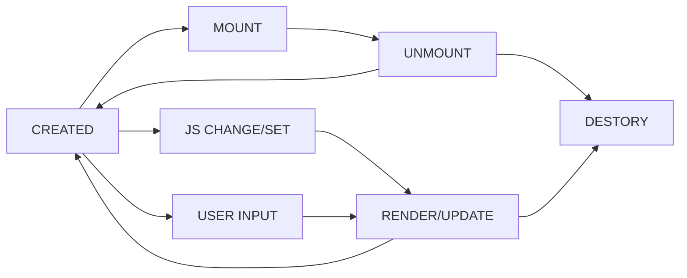

# 组件的基本知识 | 组件的基本概念和基本组成部分

**前端架构的两个大方向**

1. 组件化：如何扩展 HTML 标签，使其达到一个高复用的效果；
2. 架构模型：MVC、MVVM 前端与数据逻辑间如何交互。

**组件的基本概念**

1. 区别于模块和对象，组件是与 UI 强相关的关系；
2. 可以粗略的认为是一种特殊的模块/对象，即与 UI 绑定的关系；
3. 可以进行树形结构的组合，且具有模板化的配置能力。

可以认为组件是脱胎于对象的一种非常适合描述 UI 界面的对象模型。

**attribute 和 property**

简单的来讲就是 attribute 是属于对象或组件的固有属性，是客观的，一般不太会受到外界的影响而改变；而 property 是属于附加上的属性，属于后天覆盖上去的，可能会受到外界影响发生变化，且一般来说 property 会覆盖掉 attribute。

举例：中国人头发是黑色的，但是在染色后可以改变发色为其他颜色，此时黑色的发色就是 attribute，而改变的黄色发色就可以当做是 property，此时人们看到这个人的话会获取 property 说他头发是黄色的，但是要想知道原本发色的话就是获取 attribute 说他头发原本是黑色的。

更深入的探讨可以查看参考[1]。

**组件的状态**

1. 应该只能由组件内部进行控制，保证状态的一致性；
2. 组件内部的控制状态改变的条件应该是用户的输入，而不是组件的调用者。

举例: tab 组件可以提供 API 让调用者能够模仿用户的输入来进行改变 tab 选中状态，而不是直接暴露 tab 的 state 给调用者，让调用者去维护。

**生命周期**

基础抽象逻辑：

组件一定会有创建和销毁，当组件挂在到页面和从页面卸载时就会产生 mount/unmount，当用户输入或组件调用者改变了组件状态时，就会触发 render/update，这是组件生命周期最基础的抽象模型，可以在适当的位置添加更多细粒度的回调来添加更多的生命周期。

**children**

子组件的两大类设计方向：

1. content 类型，属于在组件的设计阶段就设计好的，最多控制显隐，但是不能改变实际子组件数量，比如卡片或者弹出框，只能由一个 title，body，footer 组成，那么就只能填充内容，而不能添加一个多余的子组件进去改变组件的设计。
2. template 类型，设计时只是一个占位性质，具体由多少个子组件最终由数据来进行控制，比如 list 的子组件 list-item 只是一个占位，具体产生多少个取决于传入的数据数量来生成。

# 组件的基本知识 | JSX 的基本使用方法

内容和 toy-react 基本一致，主要思想是将浏览器中的 Element 全部进行代理的方式来与自定义类型进行行为的统一。

# 轮播组件 | 轮播组件（一）

主要思路就是：让图片平铺，然后按当前下标进行偏移。

**解决不能无限重复的问题**

产生原因是当使用同余获取下标时，下标归零后偏移全部失效导致一次性回到 0px 位置；

要想解决这个问题就不能让所有的图片都按照一个偏移移动，需要把下一张要显示出来的图片的偏移量也计算出来，且下一张图片在移动时不需要动画。

# 轮播组件 | 轮播组件（四）

**向右滑动一圈后报错的 bug**

产生的原因应该是在 up 时没有处理好符号的问题，导致在 position 在不断的减小导致了最后的计算结果出现了问题，看了视频的评论后添加了一句代码解决掉了问题，目前理解应该是当向右移动完后，把当前下标位置（也就是 offset===0 的时候）置换为上一帧时左侧图片的下标，也就是当前显示出来的那张图片的下标，而不是单纯的减下去，而 offset!==0 的时候可以理解为只需要处理位置移动即可。

# 参考

- [1] [what-is-the-difference-between-properties-and-attributes-in-html | stack overflow](https://stackoverflow.com/questions/6003819/what-is-the-difference-between-properties-and-attributes-in-html#answer-6004028)
