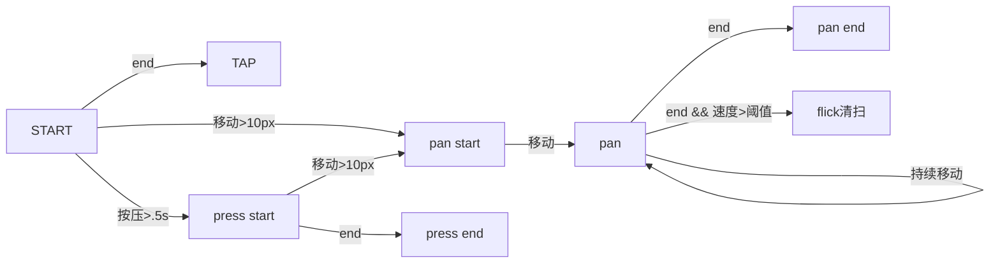

# 手势与动画 | 初步建立动画和时间线

**3 种常见的动画解决方案**

1. 使用 setinterval
2. 使用 setTimeout 来模拟 setinterval
3. 使用 HTML5 的新 api requestAnimationFrame

三种方案的优缺点对比：

1. setinterval 由于会按固定的时间去执行，所以当回调函数 tick 内逻辑比较复杂时，或者当性能下降计算性能上不去时，会导致执行结果和预期不符，发生积压、执行忽快忽慢等现象
2. setTimeout 来模拟 setinterval，可以在保证每一帧逻辑计算完毕后，再已 16 毫秒的间隔添加到事件循环中，所以在理想情况下，每一帧间隔都能保证起码是 16 毫秒
3. requestAnimationFrame 新 api 自动根据浏览器的刷新帧率动态的调整回调事件，浏览器刷新率高那么回调频率就高，浏览器刷新率低那么回调频率就低，所以理论上来说是最丝滑的

**timeline**

**为什么需要 timeline？**

因为当同一个场景中同时存在多个动画时，如果互不影响还算 ok，但是如果动画之间互相影响的话那么取值和状态监控就是一个大问题，所以就需要引入 timeline 的概念了。

**timeline 的原理**

timeline 顾名思义就是时间线，它类似现实生活中的时间一样，所有人的时间都是在一条时间线上运动的，时间对大家都是绝对的，自己经过了一秒别人也同样经过了一秒，基于这样的原理，timeline 的设计思想也是类似的，把所有的动画都统一的执行在 timeline 中，timeline 经过一帧那么所有动画都会动一帧，timeline 时间停止，那么所有动画都事件停止，也就是让所有的动画都生活在一个基于 timeline 为时间轴的世界里。

# 手势与动画 | 给动画添加暂停和重启功能

**暂停和重启的功能设计**

简单的暂停只需要取消掉 rAF 即可，但是这样存在一个问题就是虽然动画停止了，但是时间流逝并没有随着暂停而停止，而是继续的计时，这就导致了恢复时动画会出现异常效果，所以正确的思路应该是：

1. 在暂停时，记录暂停的时刻，并取消 rAF
2. 在恢复时记录下恢复时刻，并计算出`暂停-恢复`这期间的时长
3. 在 tick 调用中计算虚拟时间 t 时应考虑到`暂停-恢复`的时长，所以应该总是减去`暂停-恢复`的时长。

**如何处理属性动画的单位等问题**

可是在动画类中设置一个 template 参数，该参数是一个返回样式字符串的函数，接收一个占位值作为参数。

> 需要注意的是`暂停-恢复`的时长记录是增量的，需要每次增加单次暂停的时长，这样才能保证时间的正确性,如果没有使用增量的话，`暂停-恢复`只能生效一次。

# 手势与动画 | 手势的基本知识

**模型**

为了统一移动端与 pc 端，所以会把 touch 和 click 事件行为都抽象为 start move end。

# 手势与动画 | 处理鼠标事件

考虑到触屏会有多个触点，鼠标会同时按下多个按键的情况，所以前面对于按键按下的判断 flag 应该作为每个触点/按键的独立属性去判断，而实现的方式就是在 start-move-end 的流程中传入一个独立的 context 来进行管理。

**处理鼠标事件**

> 在处理鼠标事件时，由于鼠标有多个按键所以在按下时会有不同按键的区分，但是在移动时确实不分按键的，也就是说不按下按键也是可以移动的，所以对于鼠标按键的管理需要进行特殊处理。

在鼠标的 move 事件时，虽然没有区分按键，但是对于那个按键被按下在 event 对象中是有记录的，通过该记录可以实现区分按键的状态。

**move 中的掩码**

move 中记录鼠标按键按下状态是通过掩码来记录，即一个固定的二级制数字，每一位分别代表了一个按键的按下状态（0：没按下，1：按下），这种设计思想也可以用来做一些权限控制的设计，如：linux 文件权限的控制，页面内通用的按钮级权限的控制等。

# 手势与动画 | 实现一个 flick 事件

只考虑开始点与离开点来计算 flick 的速度的话会因为浏览器实现不同而导致有较大的差异，所以比较合适的方法是在 move 中抽样记录一段时间中的点，然后通过该段点中的开始时间与离开时间的差值与距离差值来计算 flick 的速度。

